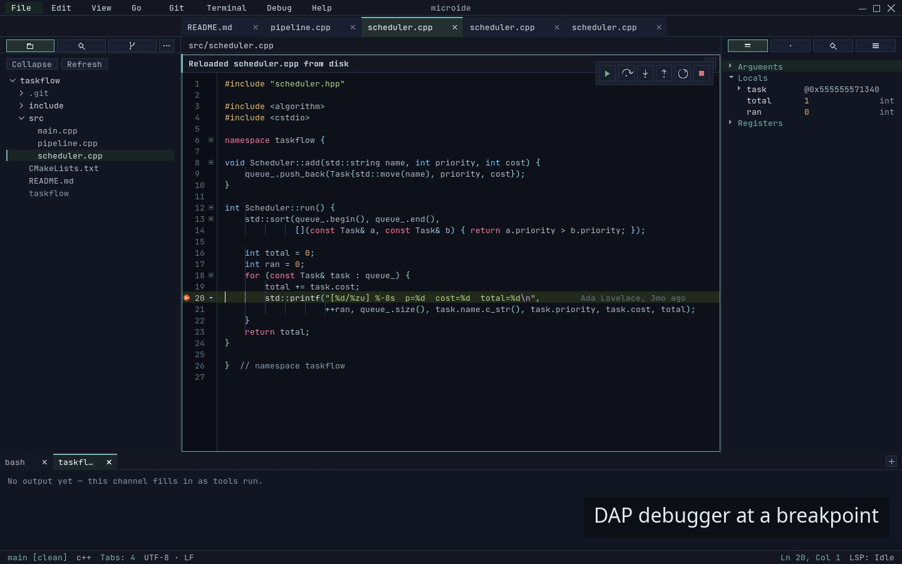

# microide

A **100% vibecoded**, native, low-footprint C++/SDL3 desktop IDE focused on built-in editor,
diff, merge, git, search, and terminal workflows. Single-window, keyboard-first, and does not
require a GPU (it uses one when available to speed up text, and runs fully on a software renderer
otherwise).

[](https://pablojimenezmateo.github.io/microide/)

> Editor, file tree, syntax highlighting, git blame, debugger pane, and terminal — captured straight
> from the running app. See the full screenshot gallery and hero demo video on the
> [project site](https://pablojimenezmateo.github.io/microide/).

For the authoritative in-scope / non-goal list see `openspec/specs/product-vision/spec.md`.

> **Status: stable.** Tagged `v2.11.0` (see [CHANGELOG](CHANGELOG.md)) and actively developed.
> Release binaries are GPG-signed — verify them per [Verifying releases](#verifying-releases).
> No third-party comparative benchmarks yet. Read [Known Limitations](#known-limitations) and
> [Security & Trust Model](#security--trust-model) before using on a real project.
>
> **Verified, not just written.** 121 test files and 10 fuzz targets back the build, gated by
> ASAN / UBSAN / TSAN sanitizer runs, committed startup/typing/scroll/diff/search performance
> baselines, and architecture-invariant lints enforced on every test run.

## Start Here

- [What microide is](#about)
- [Release status](#release-status)
- [Current UI preview](#current-ui-preview)
- [What works today](#what-works-today)
- [Agent control channel](#agent-control-channel)
- [Build or package locally](#build)
- [Known limitations](#known-limitations)
- [Plugin trust warning](#security--trust-model)
- [Performance methodology summary](#performance--benchmark-methodology)
- [Deeper docs](#companion-docs)
- [Contributing](CONTRIBUTING.md)

## About

microide is **100% vibecoded**: every source file, test, and document in this repository
was written by AI coding agents (a mix of Claude, GPT, and other tools) under human
direction. There is no hand-written code path. The repo is published as a real-world
experiment in agent-driven development — interesting to read, useful to build on. That
describes how the code was *authored*, not how mature it is: the build is stable and
covered by an extensive automated suite (unit, fuzz, sanitizer, and performance gates).
Expect the architecture notes to reflect what the agents settled on rather than a
hand-curated design, and see [Known Limitations](#known-limitations) for the honest edges.

This project does not claim to be the fastest or smallest editor. It claims to be a native,
responsive, single-window IDE with internal regression baselines for startup, typing, scroll,
diff, and search. See [Performance & Benchmark Methodology](#performance--benchmark-methodology)
for what is actually measured, and what is not.

## Highlights

### Editing
- Multi-project tabs, file tabs, an n-way split editor grid (drag a tab onto a pane edge
  to split it, up to eight panes), deferred-commit tab drag with ghost
- Drag and drop from the desktop: a file opens as a tab, a folder opens as the project
- UTF-8 codepoint boundaries, IME preedit, line-ending detection and preservation
- Multi-caret editing with position remap, region-stack highlighting, and copy-with-context
- Column/box selection by mouse (Shift+Alt+drag) and keyboard (Ctrl+Shift+Alt+Arrow): a
  rectangle of visual columns that stays straight across tabs and non-ASCII text, with a
  virtual column that survives short lines
- Soft word wrap with hanging indent; long-method fold resolution
- Syntax highlighting with per-file checkpointed state (fast random jumps in large files)
- Undo/redo storing line-range patches rather than full-buffer snapshots; word-level undo coalescing
- Durable writes with a save-time conflict guard and non-blocking external-change banner
- Git blame shadow text — asynchronous, viewport-scoped, caret-local annotations with hover commit details
- Project-local colorscheme, tab size, indent width, and soft-tabs preferences
- `.editorconfig` support: `indent_style`, `indent_size`, `tab_width`, `end_of_line`,
  `trim_trailing_whitespace`, and `insert_final_newline` are honored per file, with nearest-file
  and `root = true` precedence. It overrides both the configured indent and auto-detection, as in
  VSCode. Toggle with `editor.editorconfig.enabled`
- Session restore across restarts

### Diff & Merge
- Compare tabs: working-tree vs `HEAD`, arbitrary commits, outgoing base-branch files
- Three-way merge tabs: incoming / result / current panes with per-hunk picks and whole-side apply
- Shared decorated text-grid pipeline across editor, compare, and merge surfaces
- Change-overview lane alongside the scrollbar in both compare and merge tabs
- `[` / `]` hunk navigation; `o` opens the working-tree file at the matched line
- State preservation across rename, delete, and reopen — reopening the same target reuses the tab
- Standalone `microide_diff_bench` for repeatable before/after timing on compare hot paths

### Git
- Sidebar git view: working-tree changes, staged files, merge conflicts, outgoing branch files
- Per-file stage (`s`), discard (`x`), bulk stage-all, confirmed discard-all
- Sidebar branch row: current branch opens a filterable switch picker; Sync shows ahead/behind counts
- Conflict files open directly in the three-way merge tab
- Branch switch/create, fetch, pull, push, publish, sync, and stash push/pop — each run off the
  shell thread with git's failure classified (auth, no upstream, non-fast-forward, dirty tree, conflict)
- Editable commit message; branch/commit ref picker for compare and review
- Commit picker overlay for compare target selection

### Search
- Parallelized project-search sidebar: literal (default) or regex (Alt+R), case control (Alt+C),
  hidden-file toggle (Alt+H) — the chords work from the results list and from inside the query field
- Scope filters ("..." toggle): comma-separated files-to-include / files-to-exclude globs with `**`,
  character classes, and `{a,b}` alternation; out-of-scope files are rejected on their path and never read
- Count-all totals with match highlighting; replace-in-project in literal and regex modes (regex expands capture groups)
- In-file find & replace with match case (Alt+C), whole word (Alt+W) and regex (Alt+R) — the same
  first two toggles the terminal find bar carries, and all three apply in literal and regex mode
- File finder overlay with a cached index and quality-ranked fuzzy matching: contiguous runs, word
  starts and camelCase humps rank above scattered matches, filename matches above path-only ones, and
  the shorter, shallower path wins an otherwise-equal match
- Standalone `microide_search_bench` for repeatable timing

### Terminal
- PTY-backed terminal tabs with scrollback and selection
- Alternate-screen support, application cursor-key mode, origin mode, autowrap, bracketed paste
- OSC 52 clipboard copy (opt-in, off by default), focus notifications, basic device/cursor query replies
- Terminal text selection, copy, and paste shortcuts
- Tab drag reordering; right-click for "Copy Last Command and Output"

### Debugging
- Built-in DAP debugger (validated against gdb 17.2): per-language launch configs, line /
  function / conditional breakpoints and logpoints, gutter breakpoint menu
- Continue, Step Over / In / Out, Pause, Restart; capability-gated reverse execution
  (`reverseContinue` / `stepBack`)
- Dedicated right-side debug pane: Call Stack, Variables / Scopes (lazy tree with inline edit),
  Watch expressions, and Breakpoints — plus hover-to-inspect and exception breakpoints
- Multi-session debugging with a session selector; Debug Console REPL, with program
  stdout/stderr surfaced as an Output channel
- Agent-drivable headless debugging through the control channel (set breakpoints, start/step,
  query variables/threads from stdin/stdout)
- Gated behind `debug.enabled` (default off); enable it before the `debug-*` commands act

### Plugins
- Manual Lua 5.4 plugins from `~/.config/microide/plugins/`, run on a dedicated worker thread
  off the UI thread (host-renders-data: plugins emit data, the host owns drawing)
- Lifecycle hooks, commands, tree sidebars, diagnostics, hover providers, syntax contributions
- Editor rendering: decorations (text styles, gutter marks, end-of-line text, code lenses) and
  content surfaces (charts/previews via display lists or raster images, in a panel or anchored inline)
- Editor integration: ghost-text inline suggestions, host-owned buffer edits, and reactive editor
  events (`on_buffer_change` / `on_cursor_move` / `on_selection_change` / `on_buffer_close`)
- Language providers: definition, references, signature help, document symbols
- Presentation contributions: color themes, file-icon themes, rich status items (tone + progress)
- Host-owned registries: settings, keybindings, status items, menus, formatters, save participants,
  completion providers, code actions, tests, SCM, annotations
- `plugins-reload` command; file-watch–triggered asset reload on Linux
- Repo-owned dogfood examples: `plugins/eslint` (diagnostics), `plugins/eol-annotations`
  (decorations), `plugins/surface-preview` (content surfaces), `plugins/presentation-demo`
  (themes/icons/status), `plugins/language-tools` (language providers), `plugins/todo-highlight`
  (decorations)

## Agent Control Channel

microide can be driven from outside the window. An external process — typically an LLM agent —
gets the same control surface a person has, because the channel routes through the *same command
chokepoint* as the command palette rather than adding a parallel path. It is designed in, not
retrofitted through an extension API.

```bash
# Drive an instance and stream every response and event as JSONL on stdout.
microide --control --control-spec debug.spec.json

# Or talk to an already-running instance, one request at a time.
microide control-send "breakpoint-set src/main.cpp 42"
microide control-send debug-launch --wait stopped
microide control-send review-branch origin/main
```

The window stays open and fully interactive the whole time — an agent and a human can work the
same instance.

**What it can do**

- **Debug.** Set/remove/enable/disable breakpoints, conditions, hit counts, logpoints, and
  function breakpoints by symbol name; launch a named config or an ad-hoc program; step, continue,
  pause; query threads, frames, scopes, and variables.
- **Review.** `review-conflicts` opens one three-way merge tab per conflicted file;
  `review-branch [ref]` opens a compare tab per file differing from a ref; `review-commit [commit]`
  opens the diff of any commit. Each dedupes against open tabs and closes stale clean review tabs
  from the previous run. These are *non-mutating* — they open the tabs, they never run `git merge`.
- **Observe.** Query verbs (`debug-state`, `breakpoints`, `tabs`, `projects`, `status`,
  `launch-configs`, `adapters`) and pushed events (`stopped`, `terminated`, `output`).
- **Start ready.** `--control-spec` opens a project with breakpoints already set, files revealed,
  and a session started *before* the window is interactive.
- **Configure without side effects.** `--set <id> <value>` applies a setting live for the session
  but never writes it to the user's config, so a headless run cannot clobber someone's settings.

**Two details that matter when writing an agent against it**

`stopped` fires **twice** per stop, disambiguated by `framesPending`. The first lands the instant
the adapter halts, so an agent knows it stopped within milliseconds even while a slow adapter is
still indexing DWARF; the second carries the resolved `file`/`line`/`frames`. And `terminated`
fires for *every* end — including an adapter that crashes without sending a DAP event — so an
observer is never stranded waiting on a message that will not come.

Full protocol, spec format, security model, and the headless runbook:
[`dev-docs/control/control-channel.md`](dev-docs/control/control-channel.md).

## Scope

In-scope and non-goals are declared in `openspec/specs/product-vision/spec.md`.

Short version: built-in editor, diff, merge, search, git, terminal, and debugger/DAP workflows stay host-owned.
Out of scope: plugin marketplaces, cloud/collaboration/sync, and out-of-process plugin isolation.

The strongest, most validated workflow today is the **native diff / merge / git workstation**:
compare tabs (working-tree vs HEAD, arbitrary commits, outgoing base-branch files), three-way
merge with whole-side apply, shared decorated-text-grid rendering across editor / compare / merge,
hunk navigation, and a standalone `microide_diff_bench` for repeatable timing. Other surfaces work
but are less proven outside the developer's own machine.

Current validation flow is still intentionally narrow and practical:
`open repo -> inspect changes -> diff files -> resolve merge conflict -> stage/commit`.

## Release Status

- Tagged `v2.11.0`. The published Debian package is GPG-signed; verify the signature and checksum
  before installing — see [Verifying releases](#verifying-releases). You can also build from source
  or create a local Debian package from this repository. See [CHANGELOG](CHANGELOG.md) for what
  shipped.
- A screenshot gallery and a hero demo video ship on the [project site](https://pablojimenezmateo.github.io/microide/).
  They are generated straight from the running app (`tools/capture-media.sh`) and regenerated every
  release, so they never drift from the current UI.
- Every push and pull request runs the full validation set in CI
  ([`.github/workflows/checks.yml`](.github/workflows/checks.yml)): the test suite plus the
  architecture lint, the allocation-gated pass, ASan / UBSan / TSan, and a build-and-smoke run of
  the twelve fuzz targets. Each job drives `tools/run-checks.sh`, so a red run reproduces locally
  with the command named in its log. Perf baselines are *not* re-measured in CI — they are absolute
  timings from one pinned reference machine — but a changed baseline must carry a
  `perf-baseline:` justification, which CI does enforce. Release signing stays local: the
  maintainer key never enters CI.

### Verifying releases

Each GitHub release attaches the Debian package, a detached GPG signature (`.asc`), and a SHA256
checksum. Releases are signed with the maintainer key published as `microide-signing-key.asc` on the
release page (fingerprint `0E32 39B7 1B0F 9598 B71A  FB7B 6D33 9CCB FC51 5D70`).

```sh
# one-time: import the maintainer signing key
gpg --import microide-signing-key.asc

# verify the package signature and checksum
gpg --verify microide_2.11.0_amd64.deb.asc microide_2.11.0_amd64.deb
sha256sum -c microide_2.11.0_amd64.deb.sha256
```

A "Good signature" line plus a matching checksum means the package is authentic and intact.

## Current UI Preview

See the editor, side-by-side diff, three-way merge, debugger, and control channel in the gallery and
hero video on the [project site](https://pablojimenezmateo.github.io/microide/). Those assets are
captured from the running app by `tools/capture-media.sh` and regenerated on every release (see
[`dev-docs/project/media-generation.md`](dev-docs/project/media-generation.md)), so they stay in sync
with the shipped UI. The most honest look is still the running app: build it in two commands (see
[Build](#build)) and open your own project.

## What Works Today

Mature enough to use day-to-day on the maintainer's own work:

- editor: open / save / undo / redo, soft wrap, syntax highlighting with checkpointed state,
  multi-cursor (Alt+click, add-cursor-at-match, Shift+Alt+drag and Ctrl+Shift+Alt+Arrow column/box selection), folding,
  indent guides, bracket match, auto-close / surround driven by a language contract, snippets,
  save normalization
- compare and merge tabs: working-tree vs HEAD, vs arbitrary commit, outgoing-base-branch files,
  three-way merge with per-hunk picks and whole-side apply, `[`/`]` navigation
- git sidebar: working-tree changes, staging / discard, conflicts open into the merge tab,
  outgoing-branch file view, commit-picker overlay
- project search: async, literal and regex, replace-in-project (literal & regex), file finder
- terminal: PTY tabs, scrollback, selection / copy / paste, alternate screen, common ANSI paths
  needed by real interactive programs
- session restore across restarts; per-project config and accent color
- Lua 5.4 plugin runtime with host-owned registries

Shipped but with caveats (see [Known Limitations](#known-limitations)):

- debugger (DAP): breakpoints, stepping, call stack, variables, watch, hover, exception
  breakpoints, multi-session, and a console REPL — validated end-to-end against gdb 17.2. It is
  opt-in (`debug.enabled`, default off), and adapter coverage beyond gdb is still expanding
- LSP transport: implemented and tested against fake servers; real-world server validation is
  ongoing
- Tool downloader / SHA verification: implemented, not exercised against production tool catalogs
- Native file-watch backend: Linux `inotify` is wired into `FileIndex`; project search and file finder consume index snapshots
  instead of rescanning on each refresh. First-load indexing and large watcher bursts can still
  show refresh lag in large repositories.

## Git Workstation Workflow

Current validated flow:

1. Open a local repository (`microide /path/to/repo`) and switch to the **Git** sidebar.
2. Inspect grouped sections: **Conflicts**, **Staged**, **Unstaged**, **Untracked**, **Outgoing**.
3. Open unstaged or staged diffs from sidebar rows (or from compare tabs), then stage/unstage by
   file, hunk, or selected lines where text mapping is available.
4. Use discard actions only after confirmation/preview prompts.
5. Open conflicted files into the merge tab, resolve hunks, then stage resolved files.
6. Open commit workflow from the Git sidebar, verify staged summary, write subject/body, and
   commit.
7. On commit failure, read status/output feedback, fix the issue, and retry without losing draft
   text.

Known workflow boundaries:

- Binary, submodule, and some complex rename/file-directory conflicts are recognized but not fully
  interactive in the three-way merge UI.
- Patch staging for hunk/selected-lines can fail when the diff is stale; refresh and retry.
- Branch review markers should not be treated as a durable review database.

## Known Limitations

Honest list of what this is not, or what is unfinished. Read this before adopting microide for
serious work.

- **No comparative benchmarks.** Internal baselines compare microide against itself; the project
  has not been measured against VSCode, Zed, Helix, or any other editor. Claims like "fastest" or
  "lower CPU than X" are not supported here and are not made.
- **Piece-tree text model with a 32-bit offset ceiling.** The editor handles UTF-8 at codepoint
  boundaries for cursor movement and IME. Storage is a piece tree over an immutable original buffer
  plus an append-only add buffer: edits are O(log n) splices with no per-line heap allocation
  (see `src/editor/TextBuffer.h`). Buffer offsets are 32-bit, so there is a practical ~4 GiB
  per-file ceiling; behavior on extremely large files and pathological single long lines is still
  under measurement.
- **Capability-sandboxed plugins, not full isolation.** Plugin filesystem/process access is
  enforced per-plugin (default-deny process, project-scoped fs, Linux kernel confinement of
  spawned children), but the Lua state still runs in-process. See
  [Security & Trust Model](#security--trust-model).
- **Recovery-mode startup only.** `--disable-plugins` and `--safe-mode` skip user-scope plugins
  and (for safe mode) workspace/session restore. These are recovery/trust aids, not a sandbox.
  Opening a repository still does not load plugin code from that repository; only user-installed
  plugins under `~/.config/microide/plugins/` run when plugins are enabled.
- **Single-window only.** No detached OS windows. This is deliberate (see
  `openspec/specs/product-vision/spec.md`), not a bug.
- **No native OS menu bar.** The menu bar is rendered by the app.
- **Terminal escape coverage is "what real shells need," not exhaustive.** Programs that depend on
  uncommon DEC/xterm sequences may render incorrectly.
- **Linux-only.** Linux is the only supported host. macOS and Windows are not supported build
  targets; building and running on them is unsupported.
- **Debugger/DAP is opt-in.** A built-in DAP debugger ships (breakpoints, stepping, call stack,
  variable inspection, watch/REPL, multi-session). It is gated behind `debug.enabled`, which
  defaults to **off**; enable it before the `debug-*` commands do anything.
- **No plugin marketplace, remote install, or signed-plugin verification.** Deliberate non-goal.

If you find a bug or a limitation that is not listed, that itself is a bug — please file it.

## Security & Trust Model

microide is a local desktop application that runs with your user privileges. Plugins run in-process
(on a dedicated worker thread, off the UI thread) but under an enforced per-plugin capability
sandbox; that narrows, but does not eliminate, the trust you place in them. Treat it accordingly.

**Plugins are capability-sandboxed local code.** When you open a project, microide loads Lua plugins
only from:

- `~/.config/microide/plugins/<plugin-id>/init.lua` — user-scope plugins

Project-local directories such as `<project-root>/.microide/plugins/` are ignored. That prevents
cloned repositories from executing plugin code just because you opened them.

Plugins declare a `capabilities` table in their `init.lua` descriptor, which the host enforces:

- **Filesystem** (`ctx.files.*`) is contained to the active project root (and, for `"data"` scope,
  the plugin's `ctx.workspace.data_dir()`). Absolute paths and `..` escapes outside those roots are
  refused. Default: project-scoped read+write.
- **Process execution** (`ctx.process.run` / `run_async`, and contributed formatters / language
  servers / tasks) is **default-deny**: a plugin must declare `process.exec`, optionally with an
  `argv[0]` allowlist. On Linux, permitted children are additionally confined in the kernel —
  Landlock restricts *writes* to the project + plugin data dir, and (when network is not granted) a
  seccomp filter denies new IPv4/IPv6 sockets. Scope this honestly: the system stays
  *readable/executable* (so binaries and shared libraries resolve), `/tmp`, `/dev`, `/run`, and
  `/var/tmp` stay writable for scratch space, and the seccomp rule blocks only `AF_INET`/`AF_INET6`
  (local `AF_UNIX`/`AF_NETLINK` sockets are still allowed). Every kernel layer is **best-effort and
  fail-open**: on a kernel without Landlock/seccomp it is skipped, because the in-process capability
  gate — not the kernel layer — is the primary boundary. microide probes this support at startup and
  reports it (see below).
- **The Lua runtime** uses a narrow stdlib (`base`, `table`, `string`, `math`, `utf8`, `package`) —
  no `io`/`os` — with `package.path` pinned to the plugin directory and `package.cpath`/`loadlib`
  disabled, so plugins cannot `require` arbitrary modules or load native libraries.
- **Execution** runs on a dedicated worker thread under a per-call watchdog (a runaway plugin call
  is aborted rather than freezing the editor), and rendering contributions (decorations, content
  surfaces, ghost text) are validated, size-capped *data* that the host draws — plugins never touch
  the renderer directly.

This is real enforcement, not just documentation. On Linux the kernel confinement applies to both
`ctx.process.run` children and contributed language-server processes. Because the kernel layer is
fail-open, microide probes Landlock/seccomp availability once at startup, logs it, and exposes it on
the control channel (`status` query, `sandbox` object) so you can confirm whether kernel confinement
is actually active on your machine rather than silently skipped. What it does **not** do: first-run
capability prompts, signature/marketplace trust, or isolating the Lua state itself out of process. A
plugin you grant `process.exec` can still run tools that read your whole project. Only install
plugins you trust into `~/.config/microide/plugins/`.

**Recommendations:**

- A plugin with `process.exec` is roughly as trusted as the tools it invokes; review its
  `capabilities` and `init.lua` before installing.
- Only copy or symlink plugins into `~/.config/microide/plugins/` when you trust their source.
- The `plugins-reload` command picks up changes; `--disable-plugins` / `--safe-mode` turn plugins
  off entirely.
- Project-local plugin loading remains out of scope. See [SECURITY.md](SECURITY.md) and
  [dev-docs/project/git-workstation.md](dev-docs/project/git-workstation.md) for supported scope.

**Still out of scope.** The capability sandbox above (capability-scoped APIs, narrowed Lua stdlib,
per-plugin allowlists, kernel confinement of children) is implemented and enforced today. What is
*not* planned for the immediate roadmap is the next tier of isolation: running the Lua state
out-of-process, first-run capability prompts, and plugin signing / marketplace trust. If a plugin
marketplace or remote install flow is ever pursued — currently a deliberate non-goal — out-of-process
isolation would need to land first. For fully untrusted code, prefer external isolation (VM /
container) on top of the capability sandbox.

For the full plugin trust documentation see [guidelines/plugin-trust-model.md](guidelines/plugin-trust-model.md).

## Performance & Benchmark Methodology

microide ships a perf harness with committed baselines. The harness is reproducible locally; it
does not currently produce numbers that can be compared to other editors.

What is measured:

- **Startup** — `cold_startup_no_project`, `cold_startup_small_project`, `cold_startup_large_project`
- **Editing throughput** — `typing_small_file`, `typing_large_file`, `scroll_large_file`,
  `multi_tab_cycle`
- **Search / index** — `project_search_literal`, `project_search_regex`, `search_first_result`,
  `file_finder_cold`
- **Shell surfaces** — `compare_tab_open`, `merge_tab_open`, `compare_scroll_large_fixture`,
  `merge_scroll_large_fixture`, `git_sidebar_activate`
- **Repo-open memory** — `repo_open_rss_idle` (asserts a steady-state RSS budget after open)
- **Terminal** — `terminal_scroll_long_output`
- **Idle behavior** — `idle_soak_30s` (asserts near-zero wake events at rest), `long_soak_8h`,
  `switch_and_idle`
- **Diff hot paths** — standalone `microide_diff_bench`
- **Search** — standalone `microide_search_bench`

How it is measured:

- isolated app-root: `XDG_CONFIG_HOME` / `XDG_STATE_HOME` / `XDG_CACHE_HOME` / `XDG_DATA_HOME`
  are redirected into a per-process tempdir so the developer's real config never leaks in
- fixed seed (`MICROIDE_PERF_SEED=1337`)
- software renderer hint (`SDL_HINT_RENDER_DRIVER=software`), fixed window size, dummy audio
- committed fixtures under `tests/perf/fixtures/`
- per-scenario JSON baselines under `tests/perf/baselines/`
- explicit "smoke" vs "gate" split: smoke covers fast regression signal, gate provides the
  reference baseline used by `--reference-runner=perf-runner-v1`
- report metadata records `runner_class`, `provenance`, and resolved SDL drivers; baseline updates
  must come from `provenance: reference` runs

What is **not** measured:

- microide's startup / memory / CPU vs VSCode, Zed, Helix, Sublime, or any other editor. The
  project has no third-party comparative numbers and does not publish any.
- large-file open-to-first-paint is not yet a dedicated gate scenario. Advisory scenario
  `large_file_open_first_paint` exists for explicit local runs, but the gated suite is still
  stronger on typing, scrolling, save normalization, and compare/merge interaction than on the
  initial-paint path for very large files.
- behavior on GPU-accelerated paths. The reference harness pins the software renderer for
  determinism; GPU-accelerated paths (e.g. the batched-text glyph atlas) do run when a GPU is
  present but are validated separately, not by the gated suite.
- multi-host comparison. `perf-runner-v1` is one self-hosted runner class; results from other
  machines are advisory only.
- LTO as a proof that extraction costs are gone. LTO currently helps recover some
  cross-translation-unit optimization loss from editor extractions, but any remaining
  sticky-scroll/render-path regression should be profiled directly. Do not treat LTO as proof
  the extraction is free.

Quick local run:

```bash
cmake --preset microide-perf
cmake --build build/microide-perf-make -j8
xvfb-run -a ./build/microide-perf-make/microide/microide_perf --smoke
```

Full docs: [`dev-docs/performance/perf-harness.md`](dev-docs/performance/perf-harness.md),
[`dev-docs/performance/runtime-profiling.md`](dev-docs/performance/runtime-profiling.md),
[`dev-docs/performance/startup-tracing.md`](dev-docs/performance/startup-tracing.md).

## Companion Docs

- [`CHANGELOG.md`](CHANGELOG.md) — release history
- [Project site](https://pablojimenezmateo.github.io/microide/) (GitHub Pages; `docs/` in the repo)
- [`dev-docs/README.md`](dev-docs/README.md) — developer documentation index
- `dev-docs/project/active-work.md`
- `dev-docs/project/implementation-guide.md`
- `dev-docs/project/known-tech-debt.md`
- `guidelines/plugin-trust-model.md`
- `dev-docs/performance/perf-harness.md`
- `dev-docs/performance/runtime-profiling.md`
- `dev-docs/performance/startup-tracing.md`
- `openspec/specs/product-vision/spec.md`

## Build

Requirements:
- CMake 3.28+ and a C++20 compiler
- `pkg-config`
- SDL3 development package
- PCRE2 (`libpcre2-8`) — **required**; CMake stops with a fatal error if it is missing
- Recommended (each degrades gracefully if absent):
  - SDL3_ttf — the real font backend (without it, the built-in bitmap fallback is used)
  - Lua 5.4 — the plugin runtime (without it, Lua plugin support is disabled)
  - fontconfig — accurate `editor.font_family` matching (without it, a directory scan is used)

On Debian/Ubuntu, everything except SDL3 comes from the archive:

```bash
sudo apt-get install -y cmake ninja-build pkg-config \
  libpcre2-dev liblua5.4-dev libfontconfig-dev libfreetype-dev libharfbuzz-dev
```

**SDL3 is not packaged by Debian or Ubuntu yet** — there is no `libsdl3-dev` to
install. Build it from source with `scripts/ci/install-sdl3-linux.sh` (the same
script CI uses), or follow
[dev-docs/platform/linux-build.md](dev-docs/platform/linux-build.md).

This affects only *building* microide. The published `.deb` bundles SDL3 and
SDL3_ttf, so installing it needs nothing beyond the archive.

On other distributions, install the equivalent `-dev`/`-devel` packages.

Default build:

```bash
cmake -S . -B build
cmake --build build -j8
./build/microide/microide            # opens the current directory as the project
./build/microide/microide notes.txt  # opens the file, its directory as the project
```

With Nix (flakes), no dependencies to install:

```bash
nix build        # optimized binary -> ./result/bin/microide
nix run          # build and launch
nix develop      # drop into a shell with the full toolchain
```

Local Debian package:

```bash
./scripts/package-deb.sh
sudo ./scripts/install-deb.sh
```

The package installs `microide` into `/usr/bin`, shared assets into
`/usr/share/microide/assets`, and desktop-launcher metadata into the standard
XDG application and icon locations.

Because no Debian-family distribution packages SDL3 yet, the `.deb` bundles
`libSDL3.so.0` and `libSDL3_ttf.so.0` into `/usr/lib/<triplet>/microide` and
reaches them through an `$ORIGIN`-relative `RUNPATH`; every other dependency is a
normal `Depends:` entry satisfied from the archive. `scripts/ci/verify-deb-runtime.sh`
proves that by launching the packaged binary with the loader cache inhibited and
the library path restricted to stock system directories, and CI additionally
installs the package into a stock `ubuntu:24.04` container and runs it. Releases
are refused if either check fails.

Platform-specific setup, dependency install, and bring-up notes live in dedicated docs:

- [dev-docs/platform/linux-build.md](dev-docs/platform/linux-build.md) — Ubuntu/Debian, including building SDL3/SDL3_ttf from source
- [dev-docs/platform/host-platform-bringup.md](dev-docs/platform/host-platform-bringup.md) — local build, launch, and focused host-facing regression slice

## Project State

Per-project config and session files live under
`~/.local/state/microide/projects/<project-name>-<hash>/`.

Each project gets a persisted default accent color on first open; override it with
`project-base-color "#rrggbb"` in the per-project `config` file.

## Controls

Shortcuts follow VSCode's defaults where they apply, so most muscle memory carries
over. Compare, merge, and the git sidebar add their own single-key actions.

| Key | Action |
|-----|--------|
| `Ctrl+p` | Open file finder (fuzzy quick-open) |
| `Ctrl+b` | Toggle sidebar |
| `Ctrl+Tab` | Cycle focus: sidebar → editor → command/terminal pane |
| `Ctrl+w` | Close active tab |
| `Ctrl+f` | Buffer search |
| `Ctrl+h` | Replace in buffer |
| `Ctrl+Shift+f` | Project-wide search in sidebar |
| `Ctrl+g` | Go to line |
| `Ctrl+Shift+l` | Add cursor at all matches |
| `Ctrl+a` | Select whole buffer |
| `Ctrl+c` / `Ctrl+x` / `Ctrl+v` | Copy / Cut / Paste |
| `Ctrl+z` / `Ctrl+y` | Undo / Redo |
| `Ctrl+s` | Save |
| `Ctrl+Shift+p` | Open command palette |
| `Shift+arrows`, `Home`, `End`, `Ctrl+Home`, `Ctrl+End` | Extend selection |
| `Home` / `End` | Start / end of the view line (the wrapped row under word wrap); `Home` toggles between the first non-whitespace character and column 0 |
| `Ctrl+Shift+Alt+arrows` | Column (box) selection |
| `Ctrl+Left` / `Ctrl+Right` | Move by word (`Shift` extends) |
| `Ctrl+Backspace` / `Ctrl+Delete` | Delete the word before / after the caret |
| `Ctrl+Enter` / `Ctrl+Shift+Enter` | Insert line below / above |
| `Shift+Alt+Down` / `Shift+Alt+Up` | Copy line down / up |
| `Esc` | Collapse a multi-caret set back to one caret |
| `PageUp` / `PageDown` | Scroll viewport |
| `Shift+PageUp` / `Shift+PageDown` in terminal | Page through the transcript (`Ctrl+Shift+C` copies the selection, `Ctrl+Shift+V` pastes) |
| `d` on sidebar file | Open compare commit picker |
| `[` / `]` in compare/merge | Previous / next hunk |
| `i` `b` `c` `m` in merge | Apply incoming / base / current / both (current first) for selected hunk |
| `I` `B` `C` `M` in merge | Apply choice to every hunk |
| `a` in merge | Restore auto choices for all hunks |
| `o` in compare/merge | Open working-tree file at corresponding line |
| `s` in git sidebar | Stage selected file |
| `x` in git sidebar | Discard selected file |
| `r` in git sidebar | Refresh |
| `Ctrl+c` in terminal (with selection) | Copy terminal selection |
| `Ctrl+Shift+v` or `Shift+Insert` in terminal | Paste into terminal |
| Middle-click tab | Close tab |
| Mouse wheel on tab strip | Scroll tab overflow |

Mouse: click to focus/open, drag to reorder tabs within their strip, wheel to scroll editor/sidebar/terminal.

Drag and drop: drop a file onto the window to open it as a tab, or a folder to open
it as the project. Dropping a file when no project is open opens its parent folder
as the project first, so a drop onto the welcome screen works.

Right-click in editor: **Copy with Context** (copies `relative/path:line` + selection).  
Right-click terminal tab: **Copy Last Command and Output**.

## Commands

Run commands from the command palette (`Ctrl+Shift+p`). Current commands:

- `code-actions`
- `format-document`
- `format-json [path]`
- `rename-symbol [new-name]`
- `command-palette`
- `colorscheme [name|list]`
- `toggle-theme`
- `toggle-fullscreen`
- `completion`
- `insert-snippet`
- `compare [path] [commit-prefix]`
- `compare-files <left> <right>`
- `compare-clipboard`
- `merge <base> <incoming> <current> [output]`
- `review-conflicts`
- `review-branch [ref]`
- `review-commit [commit]`
- `reveal-in-tree`
- `files [root]`
- `find <query>`
- `find-references`
- `call-hierarchy [incoming|outgoing]`
- `focus <editor|sidebar|panel>`
- `goto-definition`
- `goto-type-definition`
- `goto-implementation`
- `goto-declaration`
- `workspace-symbol <query>`
- `signature-help`
- `goto <line[:col]>`
- `git-refresh`
- `git-switch-branch [branch]`
- `git-create-branch <name> [start-point]`
- `git-fetch`
- `git-pull`
- `git-push`
- `git-publish-branch`
- `git-sync`
- `git-stash [message]`
- `git-stash-pop`
- `terminal-find [query]`
- `mark-branch-file-reviewed`
- `unmark-branch-file-reviewed`
- `mark-branch-hunk-reviewed`
- `unmark-branch-hunk-reviewed`
- `clear-branch-review-state`
- `branch-review-note <text>`
- `indent-width [n]`
- `jump <line[:col]>`
- `open <path>`
- `about`
- `keyboard-shortcuts`
- `settings`
- `project-close`
- `project-next`
- `project-open [path]`
- `project-prev`
- `project-search [query]`
- `plugins-reload`
- `debug-toggle-enabled`
- `debug-start`
- `debug-stop`
- `debug-continue`
- `debug-step-over`
- `debug-step-in`
- `debug-step-out`
- `debug-pause`
- `debug-reverse-continue`
- `debug-step-back`
- `debug-restart`
- `debug-switch-session [n]`
- `debug-stop-all`
- `debug-repl`
- `debug-pick-config`
- `debug-pane-toggle`
- `debug-pane-callstack`
- `debug-pane-variables`
- `debug-pane-watch`
- `debug-pane-breakpoints`
- `debug-show-output`
- `breakpoint-set <file> <line> [condition]`
- `breakpoint-remove <file> <line>`
- `breakpoint-enable <file> <line>`
- `breakpoint-disable <file> <line>`
- `breakpoint-condition <file> <line> [expr]`
- `breakpoint-hit-condition <file> <line> [expr]`
- `breakpoint-logmessage <file> <line> [message]`
- `breakpoint-clear [file]`
- `breakpoint-function-add <name>`
- `breakpoint-function-remove <name>`
- `breakpoint-function-toggle <name>`
- `breakpoint-function-condition <name> [expr]`
- `breakpoint-exception-condition <filterId> [expr]`
- `debug-launch [name]`
- `debug-run [--type <adapter>] <program> [args...]`
- `set-setting <id> <value>`
- `quit`
- `reopen`
- `save [path]`
- `search <query>`
- `sidebar-close`
- `sidebar-hide`
- `sidebar-show [tool]`
- `sidebar-toggle [tool]`
- `sidebar-width <n>`
- `soft-tabs [on|off]`
- `wrap [on|off]`
- `tab [path]`
- `tab-size [n]`
- `tabmove <n>`
- `tabswitch <tab|+n|-n>`
- `term [command]`
- `term-close`
- `tests-discover`
- `tests-run [test-id...]`
- `tree [root]`
- `tree-refresh`
- `ui-scale [n|up|down|reset]`
- `layout-mode-toggle`
- `status-bar-toggle`
- `split-right [path]`
- `split-down [path]`
- `focus-other-group`
- `focus-group-left`
- `focus-group-right`
- `focus-group-up`
- `focus-group-down`
- `move-group-left`
- `move-group-right`
- `move-group-up`
- `move-group-down`
- `close-group`
- `copy`
- `cut`
- `paste`
- `redo`
- `type <text>`
- `select-all`
- `undo`
- `jump-to-matching-bracket`
- `toggle-line-comment`
- `toggle-block-comment`
- `move-line-up`
- `move-line-down`
- `copy-line-down`
- `copy-line-up`
- `insert-line-below`
- `insert-line-above`
- `delete-line`
- `indent-lines`
- `outdent-lines`
- `sort-lines-ascending`
- `sort-lines-descending`
- `add-cursor-next-match`
- `add-cursor-all-matches`
- `fold`
- `unfold`
- `fold-all`
- `unfold-all`
- `toggle-fold`
- `toggle-editor-folding`
- `toggle-editor-sticky-scroll`
- `toggle-editor-indent-guides`
- `toggle-editor-render-whitespace`
- `toggle-editor-bracket-match-highlight`
- `toggle-editor-auto-close`
- `toggle-editor-surround`
- `toggle-editor-smart-indent`
- `toggle-editor-toggle-comment`
- `toggle-editor-line-ops`
- `toggle-editor-sort-lines`
- `toggle-editor-add-cursor-at-match`
- `toggle-editor-occurrences-highlight`
- `toggle-editor-search-case-sensitive`
- `toggle-editor-snippets`
- `toggle-editor-save-trim`
- `toggle-editor-save-ensure-newline`
- `toggle-editor-auto-detect-indent`

Merge example:
```
merge /path/to/base.txt /path/to/incoming.txt /path/to/current.txt /path/to/result.txt
```

## Benchmarks & Profiling

**Diff benchmark:**
```bash
./build/microide/microide_diff_bench /path/to/repo path/to/file [--runs=N]
```
Reports diff stage timings, compare syntax timing, row-decoration build/paint timing, warm render timing, and cache hit rates.

**Search benchmark:**
```bash
./build/microide/microide_search_bench /path/to/repo query [--regex] [--case=smart|sensitive|insensitive] [--hidden] [--runs=5]
```

**Runtime profiling:**
```bash
env MICROIDE_PERF_TRACE=1 MICROIDE_PERF_TRACE_MIN_MS=1 MICROIDE_TRACE_REDRAW=1 \
  ./build/microide/microide
```
See `dev-docs/performance/startup-tracing.md` and `dev-docs/performance/runtime-profiling.md` for full workflows.

## Plugin Runtime

- Safe startup: `microide --disable-plugins` or `microide --safe-mode [project-path]` —
  see [SECURITY.md](SECURITY.md) and [dev-docs/project/git-workstation.md](dev-docs/project/git-workstation.md)
- User plugins: `~/.config/microide/plugins/<plugin-id>/init.lua`
- Repo examples: `plugins/` (copy or symlink into the user plugin directory)
- Entry point: `return require("microide").plugin({...})`
- Lifecycle hooks: `setup`, `on_project_open`, `on_project_close`, `on_buffer_open`, `on_buffer_save`, `shutdown`
- Host API: `ctx.log`, `ctx.commands.add`, `ctx.sidebar.add/show`, `ctx.workspace.*`,
  `ctx.files.*`, `ctx.process.run`, `ctx.diagnostics.*`, `ctx.hover.add`,
  `ctx.settings.*`, `ctx.menus.add`, `ctx.keybindings.add`, `ctx.status.*`,
  `ctx.formatters.add`, `ctx.save_participants.add`, `ctx.completion.add`,
  `ctx.code_actions.add`, `ctx.tasks.add`, `ctx.tools.add`, `ctx.tests.add`,
  `ctx.scm.add`, `ctx.annotations.add`
- Syntax: `syntax/*.lua` inside the user plugin directory, loaded at startup and on `plugins-reload`

## License

microide is released under the [MIT License](LICENSE).
Copyright © 2026 Pablo Jiménez Mateo.
